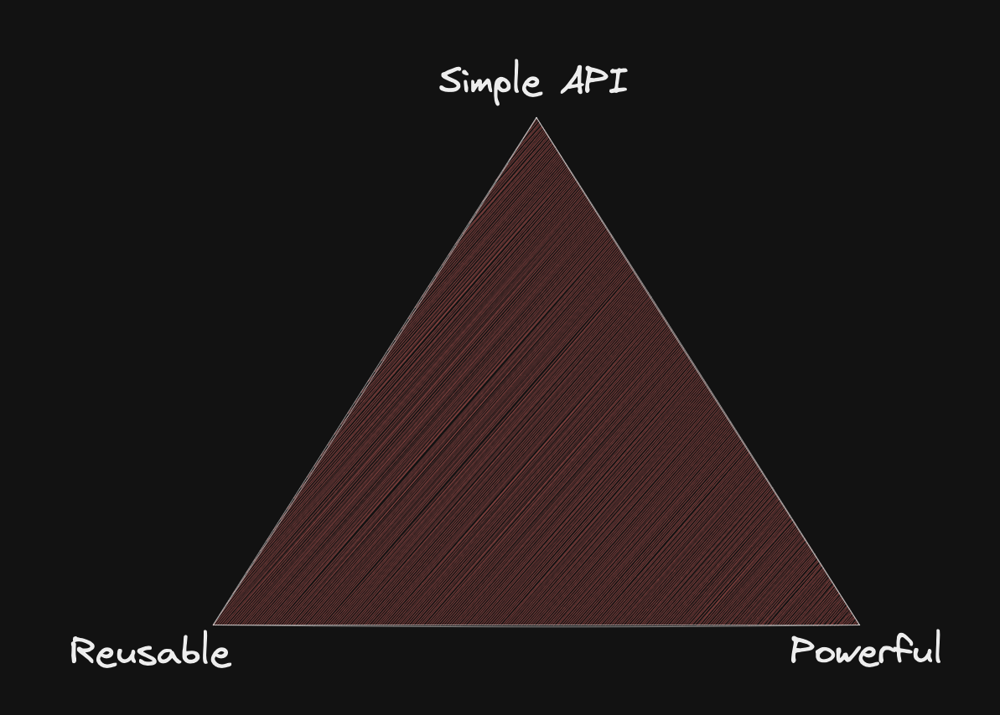

# Advanced React in 2023

- [Introduction](#introduction)
  - [Who am I?](#who-am-i)
  - [Who are you?](#who-are-you)
  - [Before we start](#before-we-start)
- [Repository setup](#repository-setup)
- [Topics](#topics)
  - [TypeScript in React](#typescript-in-react)
    - [💪 01 First steps with TypeScript](#-01-first-steps-with-typescript)
  - [Relearn the principles of React](#relearn-the-principles-of-react)
    - [The rules of React](#the-rules-of-react)
      - [💪 02 Fix the rule breaks](#-02-fix-the-rule-breaks)
    - [State in React](#state-in-react)
      - [💪 03 Impossible state](#-03-impossible-state)
      - [💪 04 Explicit states](#-04-explicit-states)
    - [useEffect, useMemo \& useCallback](#useeffect-usememo--usecallback)
      - [💪 05 Unnecessary useEffects](#-05-unnecessary-useeffects)
      - [💪 06 Sync with the outside world](#-06-sync-with-the-outside-world)
      - [💪 07 Fighting dependencies](#-07-fighting-dependencies)
    - [Imperative APIs in React](#imperative-apis-in-react)
      - [💪 08 Imperative APIs](#-08-imperative-apis)
  - [Component Patterns](#component-patterns)
    - [The children prop or JSX as props](#the-children-prop-or-jsx-as-props)
      - [💪 09 Layout-components](#-09-layout-components)
    - [Render Props](#render-props)
      - [💪 10 Render props](#-10-render-props)
    - [Compound Components](#compound-components)
      - [💪 11 Compound components](#-11-compound-components)
  - [Additional topics](#additional-topics)
    - [Security in React](#security-in-react)
    - [💪 12 Testing in React applications](#-12-testing-in-react-applications)

## Introduction

### Who am I?

- Andreas
- Developer, Trainer, Speaker
- Web technologies with main focus on TypeScript & React

### Who are you?

- Name
- Experience
- Expectations for the workshop

### Before we start

- Be curious
- Be open

## Repository setup

- Bundler/dev server: [Vite](https://vitejs.dev/)
- Styles: [Tailwind CSS](https://tailwindcss.com/)
- Tools:
  - [TypeScript](https://www.typescriptlang.org/)
  - [Prettier](https://prettier.io/)
  - [eslint](https://eslint.org/) - No checking of codestyle, formatting, and anything TypeScript already checks
- Testing:
  - [Vitest](https://vitest.dev/) - like jest but integrates with vite and is much faster
  - [React Testing library](https://testing-library.com/docs/react-testing-library/intro/)
  - [Mock Service Worker (msw)](https://mswjs.io/)

## Topics

### TypeScript in React

- TypeScript is a super set of JavaScript that adds static types
- No need to define classes or interfaces all over the place

#### 💪 01 First steps with TypeScript

Open `src/exercises/01-first-steps-with-typescript/FirstStepsWithTypeScript.tsx`

**Part 1**

- Create a new component `SimpleCounterButton`. This component should:
  - Render a button that starts with the number 10
  - When clicking on the button, the counter should be incremented by 1
  - Display the current count on the button
- Render the button in the FirstStepsWithTypeScript component.
- Make sure, that `npm run test` runs without any errors or warnings.

**Part 2**

- The SimpleCounterButton should receive a prop "incrementBy". Users of our component should be able to pass in a number that changes the incrmenetation amount. (Instead of always incrementing by 1, the counter should increment by `incrementBy` on every click)
- Users of our component should additionally be able to pass in a `style` object, that will be forwarded to the `style`-prop of the `button` element that is rendered within the SimpleCounterButton. Example: `<SimpleCounterButton incrementBy={5} style={{ border: 10px solid blue }} />` should render a button with a thick blue border.

**Part 3**

- Create a new component `RandomNumbers`, that displays a new random number every 5 seconds. For the first 5 seconds, a text `Generating a new number` should be displayed, which is then replaced by the first random number after 5 seconds.
- Render the component next to the SimpleCounterButton.

### Relearn the principles of React

Goal: Understand React instead of just using React

#### The rules of React

- Render functions must be pure
- Every created connection to the outside world must be destroyed at some point in time
- Don't update data, replace it (immutable updates)

##### 💪 02 Fix the rule breaks

- Open `src/exercises/02-fix-the-rule-breaks/FixTheRuleBreaks.tsx`
- Find all the places where one of React's rules is broken
- **Before fixing it** try to create a situation in which this rule break would cause problems
- Fix the rule break

#### State in React

**Why does a React component re-render?**

- Every render cycle (after the very first) starts with a state change.
- useState and useReducer are the two way, we can define a state in React, that can trigger a re-render.

##### 💪 03 Impossible state

**Part 1**

- Open `src/exercises/03-impossible-state/ImpossibleState.tsx`
- Define two states: `username` (initialized with an empty string) and `isValid` (initialized with `false`)
- Render an input field for the current username
- Render a button with the text "save". The button should be disabled when isValid is false.
- When the username changes, update the isValid state: The username should be between 3 and 12 characters.
- Add a second button with the text "reset", that resets the username state.
- Add a checkbox with the label "Terms of service accepted" and store the value of the checkbox in a third state (`areTermsAccepted`)
- Make sure that the form is only valid, when the terms are accepted and the username is between 3 and 12 characters long.

**Do you see how cumbersome it is to make sure the isValid flag is in sync with the state of the form?**

**Part 2**

- Try to refactor the component so that isValid is no longer a state. The thing to realize it, is that this state is completely dependant on the other two states in the form.
- Think about potential disadvantages of this approach.

##### 💪 04 Explicit states

**Part 1**

- Open `src/exercises/04-explicit-states/ExplicitStates.tsx`
- Use the functions from `src/api/satellites.ts` to load all satellites.
- Display the names of all satellites in a list.

**Part 2**

- Make sure to handle errors and loading states.

#### useEffect, useMemo & useCallback

**What is useEffect for?**

- fetch data from backend when state A changes
- update state A whenever state B changes
- addEventListeners on the document or window etc.

##### 💪 05 Unnecessary useEffects

- Open `src/exercises/05-unnecessary-use-effects/UnnecessaryUseEffects.tsx`
- This component currently has some bugs:
  - When selecting a new satellite, the form fields should be populated with the values that are fetched from the server for this satellite.
  - When creating a new satellite, the list on the left should update
  - When updating the name of a satellite, the list on the left should update
  - When switching to a new satellite, the old form state should be discarded
- Fix them! :)

##### 💪 06 Sync with the outside world

**Part 1**

- Open `src/exercises/06-sync-with-the-outside-world/SyncWithTheOutsideWorld.tsx`
- Use the [ResizeObserver-API](https://developer.mozilla.org/en-US/docs/Web/API/ResizeObserver) to display the current size (width and height) of the textarea below the heading. When you use the resize handle on the textarea, the numbers should update.
- Add a button that resets the size of the textarea (the numbers below the heading should update accordingly)

**Part 2**

- Try to abstract the logic into a reusable custom hook `useElementDimensions`

##### 💪 07 Fighting dependencies

**Part 1**

- Open `src/exercises/07-fighting-dependencies/FightingDependencies.tsx`
- Implement another counter button: A button that displays a number, and whenever you click the button, the number increments
- Below the button, a second counter should be displayed, that automatically increments every 2 seconds by the amount, that is currently displayed on the first button. (When the button shows a 10, the second counter increments by 10 every 2 seconds).

**Part 2**

- Try to abstract the interval logic into a reusable custom hook `useInterval(intervalCallback: () => void, intervalDelay: number)`

#### Imperative APIs in React

- React is declarative by default: Data gets passed around and the UI automatically follows
- The DOM is mainly imperative: createElement, appendChild, scrollIntoView()
- React normally bridges that gap for us for the most part...
- For the cases where it does not, there are escape hatches.

##### 💪 08 Imperative APIs

**Part 1**

- Open `src/exercises/08-imperative-apis/ImperativeAPIs.tsx`
- Use `useRef` to get a reference to the input and the list element (you can check `src/exercises/06-sync-with-the-outside-world/SyncWithTheOutsideWorld.tsx` as a guidance on how to type useRef)
- When clicking on the "focus input" button, the textbox should be focussed
- When clicking on the "Scoll to element" button, the list should scroll to the n-th element, depending on the current content of the textbox. If a user enters 50 and clicks the scroll button, the 50th li element should be scrolled into the view.
- Try to think of more scenarios where imperative APIs may be better than a declarative approach.

**Optional part 2**

- Read the documentation of [useImperativeHandle](https://beta.reactjs.org/reference/react/useImperativeHandle)
- Extract the list (only the list, none of the buttons or inputs) into a separate component (`UserList`), where a ref can be attached to imperatively call `scrollToElement(index: number)`

### Component Patterns

When designing components, you have to pick 2 out of the 3 following facets:


**Note:** Nothing is inherently wrong with any spot of this triangle, it depends on your goals and circumstances.

Moving around within this triangle is done by managing decisions:


#### The children prop or JSX as props

**Deciding what contents should be rendered within a component**

##### 💪 09 Layout-components

**Part 1**

- Open `src/exercises/09-layout-components/LayoutComponents.tsx`.
- Build a new component `PageContent`, that renders a horizontally centered div with a max width of 700px.
- The PageContent component should not decide what is rendered within that component, but should simply render its children. The types for the children prop can be defined like this: `function Test(props: { children: ReactNode }) {...}`
- Render the heading "Layout Components" within a PageComponent tag.

**Part 2**

- Build a new component `ContentWithSidebar`. This accepts to props: `sidebarContent` and `mainContent`, both `ReactNode`s.
- The ContentWithSidebar component should render the sidebar content on the left, and next to it, the main content.
- Use the ContentWithSidebar component in `LayoutComponents`

**Part 3**

- Add an `<input type="range" />` to the ContentWithSidebar component. Whenever users change this range slider, the width of the sidebar should adjust on the fly. Use the min and max prop on the input to define that the slide picks values between 100 and 400.
- Try to figure out, how often the mainContent is being rerendered, when users adjust the slide value.

**Optional part 4**

- Render a border between the sidebar and the main content
- Allow users to change the position of the border (and thus the width of the sidebar) via drag and drop.

#### Render Props

- We were now able to move out the decision what to render.
- However, sometimes, the rendered content needs to access data from the wrapper component.
- Additionally, we now realized, that we can pass around JSX like any other piece of data.

**Render props: Returning JSX from functions**

##### 💪 10 Render props

- Open `src/exercises/10-render-props/RenderProps.tsx`
- Copy over the solution from the previous task.
- Adapt the solution so that you can display the width of the sidebar within the sidebar content, by changing the prop definition from `sidebarContent: ReactNode` to `renderSidebar: (width: number) => ReactNode`
- Now, try to find out, how many times the sidebar content rerenders when users adjust the width of the sidebar with the slider.

**Optional Part 2 (involves TypeScript generics)**

- Define a new component `List`
- The list expects a prop `items` which is a list of any data type (use a generic type parameter to capture this data type: `function List<TItem>(props: { items: TItem[] }) {...}`)
- Within the list, render a `ul` and within that, loop over the passed items and use a render prop (`eg. renderItem`) to determine the content that needs to be rendered for the given item.

#### Compound Components

- We were now able to pass data from our library component ContentWithSidebar to our application-level component.
- This **can** have a couple of downsides:
  - Performance: Every state change in the library component triggers a re-render of the application component.
  - Effort: Passing data down multiple levels this way can become tedious.
  - Error-Prone: When other library components need access to this data, application code needs to pass around the data which can be forgotten.

To mitigate those, build component components: One conceptual component, that is split into multiple React-components but are still connected internally via React-Context.

```tsx
// Library
const CounterContext = createContext<{ counter: number } | null>(null);

function CounterButton(props: { children: ReactNode }) {
  const [counter, setCounter] = useState(0);

  return (
    <button onClick={() => setCounter(counter + 1)}>
      <CounterContext.Provider value={{ counter }}>
        {props.children}
      </CounterContext.Provider>
    </button>
  );
}

function useCounter() {
  const counterValue = useContext(CounterContext);
  if (!counterValue) {
    throw new Error("No CounterContext.Provider found.");
  }

  return counterValue.counter;
}

function CounterDisplay() {
  const counter = useCounter();
  return <>{counter}</>;
}

// App code:
function App() {
  return (
    <CounterButton>
      The current count is at <CounterDisplay />
    </CounterButton>
  );
}
```

##### 💪 11 Compound components

**Part1**

- Start with your solution from `src/exercises/09-layout-components/LayoutComponents.tsx`
- Define a new component `SidebarWidth` that displays the sidebar width of the nearest ContentWithSidebar component (define and use a ReactContext for this).
- Use your SidebarWidth component, to render the width of the sidebar.
- Check how often the rest of your sidebar content re-renders with this approach.

**Part2**

- Try to find examples in libraries that you have used in your projects, that apply this pattern.

### Additional topics

#### Security in React

#### 💪 12 Testing in React applications

**We are using vitest** in this project. It has mostly the same APIs as Jest but is much faster and reuses `vite.config.ts`.

- Open `src/exercises/12-testing-in-react-applications/TestingInReactApplications.tsx` and the test file directly next to it.
- Run `npx vitest` in a terminal to start the test runner vitest in watch mode.

**Part 1**: Unit tests

- Extract the main logic out of `FizzBuzzButton` and export it as a function
- Write test cases for that new function that checks the following properties:
  - It should return the fizzValue, a space and the buzzValue for numbers that are divisible by 3 and 5
  - It should return the fizzValue for numbers divisible by 3
  - It should return the buzzValue for numbers divisible by 5
  - It should return the number for all other cases.

**Part 2**: Component tests

- Use the documentation for [React testing library](https://testing-library.com/docs/react-testing-library/example-intro) to render the FizzBuzzButton component and check that it renders without errors and that it follows the fizz buzz rules.

**Part 3**: Components with side effects

- Use the same React testing library guide, together with [msw](https://mswjs.io/docs/), to test the `SatelliteList` component and check if it displays a loading indicator initially, if it displays an error message when the request fails, and if data is displayed if the request succeeds.

<link rel="stylesheet" href="./README.css">
<script src="./README.js"></script>
